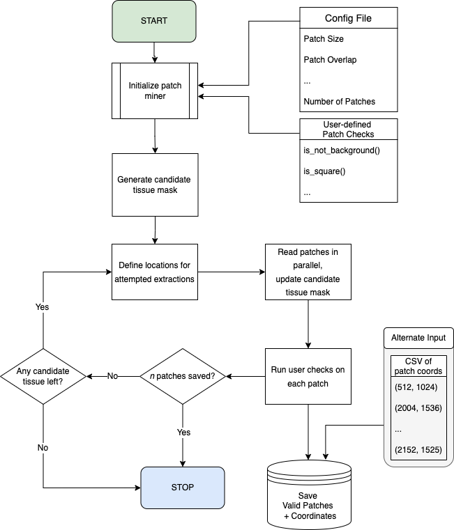

# OPM

<p align="center">
    <a href="https://pypi.org/project/OpenPatchMiner"></a>
    <a href="https://anaconda.org/conda-forge/openpatchminer"></a>
    <a href="https://dev.azure.com/CBICA/OPM/_build?definitionId=15" alt="Windows_3.6"></a>
</p>

### Open Patch Manager: parallel reading/writing of patches.

## Installation: 

### For Usage Only
```powershell
conda create -p ./venv python=3.8.12 -y
conda activate ./venv
pip install OpenPatchMiner
## alternate
# conda install -c conda-forge openpatchminer
```

### For OPM Development
```powershell
git clone https://github.com/CBICA/OPM.git
cd OPM/
conda create -p ./venv python=3.8.12 -y
conda activate ./venv
pip install .
```

## Usage
To try an example:
```powershell
# continue from virtual environment shell
# Extract 10 tissue patches from images/example_slide.tiff
python patch_miner.py -i images/example_slide.tiff -lm images/example_lm.tiff -o example -c opm/config.yml
# Use the output manifest from last run (example/list.csv) to re-extract the same patches for a different replicate
# This is useful if you have multiple slides/label maps and you want corresponding coordinates from each of them
python patch_miner.py -i images/example_slide.tiff -lm images/example_lm.tiff -c opm/config.yml -o example_replicate --input_csv example/list.csv
```
By default it detects tissue and extracts 1000 random patches from the included .svs file. Play with this number as well as the number of parallel threads in example.py (default patches=1000, default threads=100)
## Options
There are also a handful of useful options:
- `READ_TYPE`: either 'sequential' or 'random'. If sequential, it repeatedly takes the top-leftmost valid index until quota is met or the slide is saturated. If random, it randomly samples a patch from the valid indices until saturated or the quota is hit.

... and various other parameters such as patch size, thumbnail/valid mask scale, and masking thresholds.

## Workflow
OPM follows the following workflow:



## Project Structure
```
.
├── images
│   ├── example_lm.tiff
│   ├── example_slide.tiff
│   └── opm_flowchart.png
├── LICENSE.txt
├── opm
│   ├── config.py
│   ├── __init__.py
│   ├── patch_manager.py
│   ├── patch.py
│   └── utils.py
├── patch_miner.py
├── README.md
├── setup.cfg
└── setup.py
```

## Changelog
Dec. 14, 2021:
- Replaced slide library with tifffile
- Made barebones OpenSlide mimic with tifffile, named SlideObject
- Updated requirements, bumped minimum python from 3.6 --> 3.8 (due to zarr requirements)
- Updated README


Dec. 9, 2021:
- Changed backend to Pandas.
- Updated README

Nov. 17, 2020:
- Added support for mining patches from label map along with the slide.
- Updated README

Jul. 31, 2020:
- Changed `ALLOW_OVERLAP` to `OVERLAP_FACTOR`. `OVERLAP_FACTOR` is a float from 0 to 1 that is the portion of patches that are allowed to overlap. If 0, there is no overlap allowed. If 1, they are totally allowed to overlap (except for the origin pixel). 
