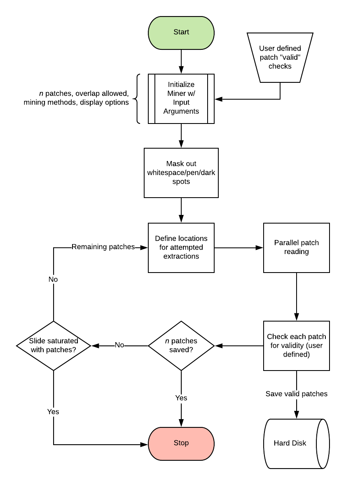

# Summary

The transition of histopathology from analog to digital has opened the world of medicine to new classes of algorithms aimed at aiding typical pathological analysis. Whole slide images (WSI) can be gigapixel sized, and rendering the whole image into memory is typically infeasible. To work around this limitation, researchers typically extract small square sections of the whole slide in order to train algorithms. 

# Statement of need

Despite patch extraction being requisite for applying algorithms to digital histopathology, there are very few applications which automatically generate small patches from the entire WSI, which is a critical first step during computational histopathology analysis [@gurcan2009histopathological; @tizhoosh2018artificial]. Additionally, accompanying information and relevant metadata must be saved with patches [@hou2016patch; @cui2021artificial]. This includes, but is not limited to, the coordinates of patches, the associated patient information, corresponding segmentation maps, and pixel classes represented in the patches. 

Open Patch Miner (OPM) provides a high-level library capable of tissue detection, parallel patch extraction, validation, and saving of patches. It has a modular nature, allowing for users to define custom checks to determine which patches should be saved, and where patches should be extracted from. Additionally, OPM can automatically determine candidate tissue regions and will save either a predetermined number of patches, or will extract patches until no more can be called without the allowed overlap. Currently, OPM is used in the Generally Nuanced Deep Learning Framework (GaNDLF) [@pati2021gandlf] to extract patches from a WSI for training neural networks.

# Method

Once initialized, OPM begins by masking out background whitespace, pen markings, and other artifacts as defined by user settings. This generates a binary mask which defines the valid candidate regions within the image. Next, the desired number of patches are read, and each patch is passed through a series of user-defined checks. If a patch passes all checks, it is saved along with all associated information. This process continues until either the required number of patches have been saved or no more patches exist in the valid candidate regions of the image. The overall flowchart is illustrated in \autoref{fig:flowchart}.

# Acknowledgements

We acknowledge contributions from Caleb Grenko, Sarthak Pati, Siddhesh Thakur, and Spyridon Bakas.

# References
